# Data Model (AI)

## 1. Database Diagram

Source: `learn-ops-api/LearningAPI/models/` (`coursework/`, `people/`, `skill/`, `tag.py`). Every table also has an auto `id` primary key.

```mermaid
erDiagram
    %% ---------- Users (Django auth) ----------
    AuthUser {
        int id PK
        string username
        string first_name
        string last_name
        string email
        bool is_staff "staff = instructor/coach"
    }
    NssUser {
        int id PK
        int user_id FK "1:1 -> AuthUser"
        string slack_handle "nullable"
        string github_handle "nullable"
    }

    %% ---------- Cohorts ----------
    Cohort {
        int id PK
        string name UK
        string slack_channel
        date start_date
        date end_date
        date break_start_date
        date break_end_date
        bool active
    }
    CohortInfo {
        int id PK
        int cohort_id FK "1:1 -> Cohort"
        string student_organization_url
        string github_classroom_url
        string attendance_sheet_url
        string client_course_url
        string server_course_url
        string zoom_url
    }
    NssUserCohort {
        int id PK
        int nss_user_id FK
        int cohort_id FK
        bool is_github_org_member
    }
    CohortEventType {
        int id PK
        string description
        string color "hex"
    }
    CohortEvent {
        int id PK
        int cohort_id FK
        int event_type_id FK
        string event_name
        datetime event_datetime
        text description
        datetime created_at
        datetime updated_at
    }
    CohortCourse {
        int id PK
        int cohort_id FK
        int course_id FK
        bool active
        smallint index
    }
    StudentTeam {
        int id PK
        int cohort_id FK
        string group_name
        bool sprint_team
        string slack_channel
    }
    NSSUserTeam {
        int id PK
        int team_id FK
        int student_id FK
    }
    GroupProjectRepository {
        int id PK
        int team_id FK
        int project_id FK
        string repository
    }
    Opportunity {
        int id PK
        int senior_instructor_id FK
        int cohort_id FK
        string portion "CLI | SER"
        date start_date
        text message
    }

    %% ---------- Coursework ----------
    Course {
        int id PK
        string name
        date date_created
        bool active
    }
    Book {
        int id PK
        int course_id FK
        string name
        text description
        int index
    }
    Project {
        int id PK
        int book_id FK
        string name
        string implementation_url
        string client_template_url
        string api_template_url
        int index
        bool active
        bool is_group_project
    }
    StudentProject {
        int id PK
        int student_id FK
        int project_id FK
        date date_created
    }
    ProjectNote {
        int id PK
        int user_id FK
        int project_id FK
        text note
    }
    Capstone {
        int id PK
        int student_id FK
        int course_id FK
        string proposal_url
        string repo_url "nullable"
        text description
    }
    ProposalStatus {
        int id PK
        string status
    }
    CapstoneTimeline {
        int id PK
        int capstone_id FK
        int status_id FK
        datetime date
    }
    StudentMentor {
        int id PK
        int student_id FK
        int mentor_id FK
        int capstone_id FK
    }
    TaxonomyLevel {
        int id PK
        string level_name
    }
    LearningObjective {
        int id PK
        int bloom_level_id FK
        string swbat
    }
    LightningExercise {
        int id PK
        string name
        text description
    }

    %% ---------- Tags ----------
    Tag {
        int id PK
        string name
    }
    ProjectTag {
        int id PK
        int project_id FK
        int tag_id FK
    }
    LightningTag {
        int id PK
        int exercise_id FK
        int tag_id FK
    }
    ObjectiveTag {
        int id PK
        int objective_id FK
        int tag_id FK
    }
    StudentTag {
        int id PK
        int student_id FK
        int tag_id FK
    }

    %% ---------- Assessments ----------
    Assessment {
        int id PK
        int book_id FK
        string name
        string source_url
        string type "SELF | ASSIGNED"
    }
    AssessmentObjective {
        int id PK
        int assessment_id FK
        int objective_id FK
    }
    AssessmentWeight {
        int id PK
        int assessment_id FK
        int weight_id FK
    }
    StudentAssessmentStatus {
        int id PK
        string status
    }
    StudentAssessment {
        int id PK
        int student_id FK
        int assessment_id FK
        int status_id FK
        int instructor_id FK "nullable"
        string url
        date date_created
    }

    %% ---------- Notes / personality ----------
    StudentNoteType {
        int id PK
        string label
    }
    StudentNote {
        int id PK
        int student_id FK
        int coach_id FK
        int note_type_id FK "nullable"
        text note
        datetime created_on
    }
    OneOnOneNote {
        int id PK
        int student_id FK
        int coach_id FK
        text notes
        datetime session_date
    }
    StudentPersonality {
        int id PK
        int student_id FK "1:1 -> NssUser"
        string briggs_myers_type "nullable"
        int bfi_extraversion
        int bfi_agreeableness
        int bfi_conscientiousness
        int bfi_neuroticism
        int bfi_openness
    }

    %% ---------- Skill tracking ----------
    LearningWeight {
        int id PK
        string label
        int weight
        int tier
    }
    LearningRecord {
        int id PK
        int student_id FK
        int weight_id FK
        bool achieved
        date created_on
    }
    LearningRecordEntry {
        int id PK
        int record_id FK
        int instructor_id FK
        text note
        date recorded_on
    }
    CoreSkill {
        int id PK
        string label
    }
    CoreSkillRecord {
        int id PK
        int student_id FK
        int skill_id FK
        int level "1-10"
        date created_on
    }
    CoreSkillRecordEntry {
        int id PK
        int record_id FK
        int instructor_id FK
        text note
        date recorded_on
    }

    %% ---------- Foundations (standalone, no FKs) ----------
    FoundationsExercise {
        int id PK
        string learner_github_id "matches NssUser.github_handle by value only"
        string learner_name
        string title
        string slug
        int attempts
        bool complete
        datetime completed_on
        datetime first_attempt
        datetime last_attempt
        text completed_code
        bool used_solution
    }
    FoundationsLearnerProfile {
        int id PK
        string learner_github_id
        string learner_name
        string cohort_type
        int cohort_number
    }

    %% ---------- Relationships ----------
    AuthUser ||--|| NssUser : "user (1:1)"

    NssUser ||--o{ NssUserCohort : "assigned_cohorts"
    Cohort ||--o{ NssUserCohort : "members"
    Cohort ||--o| CohortInfo : "info (1:1)"
    Cohort ||--o{ CohortEvent : "events"
    CohortEventType ||--o{ CohortEvent : "event_type"
    Cohort ||--o{ CohortCourse : "courses"
    Course ||--o{ CohortCourse : "cohorts"
    Cohort ||--o{ StudentTeam : "cohort"
    StudentTeam ||--o{ NSSUserTeam : "team"
    NssUser ||--o{ NSSUserTeam : "student"
    StudentTeam ||--o{ GroupProjectRepository : "repositories"
    Project ||--o{ GroupProjectRepository : "project"
    Cohort ||--o{ Opportunity : "ta_opportunities"
    NssUser ||--o{ Opportunity : "senior_instructor"

    Course ||--o{ Book : "books"
    Book ||--o{ Project : "child_projects"
    NssUser ||--o{ StudentProject : "projects"
    Project ||--o{ StudentProject : "students"
    NssUser ||--o{ ProjectNote : "user"
    Project ||--o{ ProjectNote : "project"
    NssUser ||--o{ Capstone : "capstones"
    Course ||--o{ Capstone : "course"
    Capstone ||--o{ CapstoneTimeline : "statuses"
    ProposalStatus ||--o{ CapstoneTimeline : "status"
    Capstone ||--o{ StudentMentor : "capstone"
    NssUser ||--o{ StudentMentor : "mentors (as student)"
    NssUser ||--o{ StudentMentor : "students (as mentor)"
    TaxonomyLevel ||--o{ LearningObjective : "objectives"

    Tag ||--o{ ProjectTag : "projecttags"
    Project ||--o{ ProjectTag : "projecttags"
    Tag ||--o{ LightningTag : "lightningtags"
    LightningExercise ||--o{ LightningTag : "lightningtags"
    Tag ||--o{ ObjectiveTag : "objectivetags"
    LearningObjective ||--o{ ObjectiveTag : "objectivetags"
    Tag ||--o{ StudentTag : "students"
    NssUser ||--o{ StudentTag : "tags"

    Book ||--o{ Assessment : "assessments"
    Assessment ||--o{ AssessmentObjective : "assessment"
    LearningObjective ||--o{ AssessmentObjective : "objective"
    Assessment ||--o{ AssessmentWeight : "weight_assignments"
    LearningWeight ||--o{ AssessmentWeight : "assessment_assignments"
    Assessment ||--o{ StudentAssessment : "students"
    StudentAssessmentStatus ||--o{ StudentAssessment : "status"
    NssUser ||--o{ StudentAssessment : "assessments (as student)"
    NssUser |o--o{ StudentAssessment : "assignments (as instructor)"

    NssUser ||--o{ StudentNote : "notes (as student)"
    NssUser ||--o{ StudentNote : "coach"
    StudentNoteType |o--o{ StudentNote : "note_type"
    NssUser ||--o{ OneOnOneNote : "feedback (as student)"
    NssUser ||--o{ OneOnOneNote : "coach_notes (as coach)"
    NssUser ||--o| StudentPersonality : "personality (1:1)"

    NssUser ||--o{ LearningRecord : "learning_records"
    LearningWeight ||--o{ LearningRecord : "records"
    LearningRecord ||--o{ LearningRecordEntry : "entries"
    NssUser ||--o{ LearningRecordEntry : "student_records (as instructor)"
    NssUser ||--o{ CoreSkillRecord : "core_skills"
    CoreSkill ||--o{ CoreSkillRecord : "skill"
    CoreSkillRecord ||--o{ CoreSkillRecordEntry : "notes"
    NssUser ||--o{ CoreSkillRecordEntry : "student_skills (as instructor)"
```



Notes on the diagram:

- **Many-to-many through tables.** `StudentTeam.students` is declared as M2M → `NssUser` through `NSSUserTeam`. `Assessment.objectives` is M2M → `LearningWeight` through `AssessmentWeight`, even though the field is named "objectives". The other join tables (`NssUserCohort`, `CohortCourse`, `StudentProject`, `StudentTag`, `*Tag`, `AssessmentObjective`) are plain FK pairs with no `ManyToManyField` declared.
- **Unique pairs** (`unique_together`): `NssUserCohort(nss_user, cohort)`, `CohortCourse(cohort, course)`, `StudentProject(student, project)`, `StudentAssessment(student, assessment)`, `StudentTag(student, tag)`, `LearningRecord(student, weight)`.
- **NssUser plays several roles.** Students and staff are both `NssUser` (`auth_user.is_staff` decides which). So several tables have two FKs to `NssUser`: student plus coach, mentor or instructor.
- **Left out:** `CohortGithubProject` (`people/github_project_link.py`) and `OpportunityUser` (`people/opportunity_user.py`). Neither is imported in `people/__init__.py` and no migration mentions them, so they have no tables.

## 2. Database Info

**Database type:** PostgreSQL. Local Docker pins version `16`. The Digital Ocean spec declares version `"12"` but may be out of date (see below). Tests run on SQLite instead.

**ORM:** Django ORM. The driver is `psycopg2-binary`, locked at `==2.9.12`.

### By environment

| Environment | Engine | Version (as written) | Source |
|---|---|---|---|
| Local dev (Docker) | PostgreSQL | `postgres:16` (major version only; any 16.x image) | `learn-ops-infrastructure/docker-compose.yml:3` (`image: postgres:16`) |
| Django app (all non-test runs) | PostgreSQL | not pinned | `learn-ops-api/LearningPlatform/settings.py:197` (`'ENGINE': 'django.db.backends.postgresql_psycopg2'`) |
| Tests (pytest) | SQLite, in-memory (`NAME: ':memory:'`) | not pinned (uses the SQLite bundled with Python) | `learn-ops-api/LearningPlatform/test_settings.py:39` (`'ENGINE': 'django.db.backends.sqlite3'`) |
| Production (Digital Ocean managed DB spec) | PostgreSQL (`engine: PG`) | `"12"` | `learn-ops-api/config/learn-ops-api.yaml:8` (engine), `:12` (version) |

### Supporting evidence (engine only, no server version)

| File : line | What it shows |
|---|---|
| `learn-ops-api/Pipfile:24` | `psycopg2-binary = "*"` (Postgres driver, unpinned in Pipfile) |
| `learn-ops-api/Pipfile.lock:579-651` | `psycopg2-binary` locked to `==2.9.12` (driver version, not server version) |
| `learn-ops-api/Pipfile:23` | `dj-database-url = "*"` is installed, but nothing in `LearningPlatform/` or `LearningAPI/` imports it |
| `learn-ops-api/Dockerfile:14` | installs `postgresql-client` from apt, unpinned (base image `python:3.11.11`, line 2) |
| `learn-ops-api/entrypoint.sh:7-16` | `wait_for_postgres` waits for the DB at `$LEARN_OPS_HOST:$LEARN_OPS_PORT` |
| `learn-ops-infrastructure/docker-compose.yml:74` | `postgres-exporter:latest` (Prometheus metrics for Postgres) |

### Caveat: is the production version really 12?

- `config/learn-ops-api.yaml` passes the database to the app as `DATABASE_URL` (line 18). But `settings.py:195-204` never reads `DATABASE_URL`. It reads `LEARN_OPS_DB`, `LEARN_OPS_USER`, `LEARN_OPS_PASSWORD`, `LEARN_OPS_HOST` and `LEARN_OPS_PORT`.
- The deploy workflow `.github/workflows/main.yml` runs on a `self-hosted` runner (line 36) and restarts a systemd service (`sudo service learning restart`, line 54). That looks like a hand-managed droplet, not the App Platform setup the YAML describes.
- So the `"12"` in the YAML may not be the production Postgres version. Nothing in the repo states the real one; you'd have to run `SELECT version();` against production to know.

### Searched with no database declaration

- `learn-ops-api/requirements.txt` (empty, 0 lines).
- `learn-ops-api/.github/workflows/seed.yml`, `main.yml` and `collectstatic.yml` (no DB service or version).
- `learn-ops-client/` (frontend only).
- `service-monarch/` (`docker-compose.yml`, `Dockerfile`, `deploy.yml`; its models are Pydantic, not a database).
- `learn-ops-infrastructure/valkey/docker-compose.yml` (Valkey cache, not the database).
- `.env` / `.env.template`: only credentials and host variables, no engine or version.
- No Terraform, CloudFormation or ECS files exist in the workspace.

## 3. Model to Table Mapping

| Model Name | Table Name |
|------------|------------|
| `Book` | `LearningAPI_book` |

| Property Name | Column Name | Data Type (PostgreSQL) |
|---------------|-------------|-----------|
| `id` (implicit) | `id` | `integer` (identity / auto-increment) |
| `name` | `name` | `varchar(75)` |
| `course` | `course_id` | `integer` |
| `description` | `description` | `text` |
| `index` | `index` | `integer` |

### Part 1: How the app talks to the database

**ORM:** the Django ORM. A request reaches it in three steps:

1. Django REST Framework routes it to a ViewSet. Here that's `BookViewSet(ViewSet)` at `learn-ops-api/LearningAPI/views/book_view.py:10`.
2. The ViewSet calls the ORM on the model class. For example, `Course.objects.get(...)` at `book_view.py:26` and `book.save()` at `book_view.py:30`.
3. The ORM turns those calls into SQL. It sends the SQL through the `psycopg2` driver (`learn-ops-api/Pipfile:24`, locked `==2.9.12` at `Pipfile.lock:651`).

In this view, DRF serializers only turn the saved object into JSON (`book_view.py:31`). They don't write to the database here.

**Connection config:** `learn-ops-api/LearningPlatform/settings.py:195-204`.

| Key | Value as written | Line |
|---|---|---|
| `ENGINE` | `'django.db.backends.postgresql_psycopg2'` | `settings.py:197` |
| `NAME` | `os.getenv("LEARN_OPS_DB")` | `settings.py:198` |
| `USER` | `os.getenv("LEARN_OPS_USER")` | `settings.py:199` |
| `PASSWORD` | `os.getenv("LEARN_OPS_PASSWORD")` (value `<redacted>`) | `settings.py:200` |
| `HOST` | `os.getenv("LEARN_OPS_HOST")` | `settings.py:201` |
| `PORT` | `os.getenv("LEARN_OPS_PORT")` | `settings.py:202` |

None of these has a default in `settings.py`. If a variable is missing, Django gets `None`.

**Where the variables are defined:**

- The Docker API container loads them from `learn-ops-api/.env` (`learn-ops-infrastructure/docker-compose.yml:22`, `env_file: "../learn-ops-api/.env"`). I did not read that file. It holds the real values.
- `learn-ops-api/.env.template:7-11` gives the template values:
  - `LEARN_OPS_HOST=database`: the compose service name, so it only resolves inside the Docker network.
  - `LEARN_OPS_PORT=5432`: the container-side port.
  - `LEARN_OPS_DB=learningplatform`
  - `LEARN_OPS_USER=learnops`
  - `LEARN_OPS_PASSWORD`: `<redacted>`
- `learn-ops-api/entrypoint.sh:9-10` also reads `LEARN_OPS_HOST`, `LEARN_OPS_PORT` and `LEARN_OPS_USER`, to wait for Postgres with `pg_isready`.

**Two settings files:**

- `settings.py`: PostgreSQL, used at runtime.
- `LearningPlatform/test_settings.py:37-42`: `django.db.backends.sqlite3` with `NAME: ':memory:'`, used by tests.

Everything below assumes `settings.py` (PostgreSQL).

### Part 2: Model fields vs. SQL columns (`Book`)

**Why `Book`:** it has a ForeignKey (`course`, `learn-ops-api/LearningAPI/models/coursework/book.py:7`), and Part 3's `create` method saves a `Book`. The model folders are listed in section 1: `coursework/`, `people/`, `skill/` and `tag.py` under `LearningAPI/models/`.

**Table name:** `LearningAPI_book`. That's the Django default, `<app_label>_<model name lowercased>`:

- The app label is `LearningAPI` (`LearningAPI/apps.py`, `name = 'LearningAPI'`; `settings.py:103`).
- The repo has no `db_table` or `db_column` anywhere, in the models or the migrations.

| Python field | Field class | SQL column | SQL data type (PostgreSQL) | Constraints |
|---|---|---|---|---|
| *(implicit)* `id` | `AutoField` (`settings.py:157` `DEFAULT_AUTO_FIELD = 'django.db.models.AutoField'`) | `id` | `integer`, auto-incrementing (see note) | PRIMARY KEY, NOT NULL. Migration `0001_initial.py:31` |
| `name` | `CharField(max_length=75)` (`book.py:6`) | `name` | `varchar(75)` | NOT NULL. Migration `0001_initial.py:32` |
| `course` | `ForeignKey("Course", on_delete=CASCADE, related_name="books")` (`book.py:7`) | `course_id` (Django adds `_id`) | `integer` (matches `LearningAPI_course.id`) | NOT NULL; FOREIGN KEY → `LearningAPI_course(id)`, deferrable; indexed. `ON DELETE CASCADE` is done by Django in Python, not by the database. Migration `0001_initial.py:300-304` |
| `description` | `TextField(default='')` (`book.py:8`) | `description` | `text` | NOT NULL. `default=''` is applied by Django; no database default. Migration `0025_book_description.py:13-17` |
| `index` | `IntegerField(default=0)` (`book.py:9`) | `index` | `integer` | NOT NULL. Default applied by Django. Added as `cardinality` in `0013_book_cardinality.py:13-17`, renamed to `index` in `0024_rename_cardinality_book_index_and_more.py:13-17` |

**Engine for these types:** PostgreSQL.

- The type mapping comes from Django's Postgres backend, `django/db/backends/postgresql/base.py`:
  - `AutoField` → `integer` (line 97)
  - `CharField` → `varchar(%(max_length)s)` (lines 83-86, 101)
  - `IntegerField` → `integer` (line 109)
  - `TextField` → `text` (line 121)
  - `AutoField` suffix `GENERATED BY DEFAULT AS IDENTITY` (line 131)
- Caveat: I read that file from a Django 5.2.0 install that belongs to another project on this machine. This project locks Django `==5.2.17` (`Pipfile.lock:435`), and the 5.2 releases share this mapping. On SQLite (the test settings) the types differ.

**Note on `id`:**

- Migration `0001_initial.py` was generated by Django 4.0.1 (line 1).
- The actual column type depends on which Django version *ran* the migration against a given database.
  - A database built fresh today with Django 5.2 gets `integer GENERATED BY DEFAULT AS IDENTITY`.
  - A database migrated back in 2022 under Django 4.0 would have a `serial` column. That's from general knowledge of Django 4.0, not something the repo shows.
- To see which one you have, run `\d "LearningAPI_book"` in psql.

**Column order in the table:** `id, name, course_id, index, description`. Columns land in the order the migrations added them, so `description` comes last (migration 0025, after 0013).

### Part 3: What `book.save()` does

`learn-ops-api/LearningAPI/views/book_view.py:15-34`:

```python
15	    def create(self, request):
16	        """Handle POST operations
17	
18	        Returns:
19	            Response -- JSON serialized instance
20	        """
21	        book = Book()
22	        book.description = request.data["description"]
23	        book.name = request.data["name"]
24	        book.index = request.data["index"]
25	
26	        course = Course.objects.get(pk=int(request.data["course"]))
27	        book.course = course
28	
29	        try:
30	            book.save()
31	            serializer = BookSerializer(book, context={'request': request})
32	            return Response(serializer.data, status=status.HTTP_201_CREATED)
33	        except Exception as ex:
34	            return Response({"reason": ex.args[0]}, status=status.HTTP_400_BAD_REQUEST)
```

**What's called:** `book.save()` (line 30), as the question says.

- It is *not* `serializer.save()` or `Book.objects.create()`.
- The view builds the instance by hand (lines 21-27). It uses `BookSerializer` only to produce the response JSON (line 31).
- There's a second query before it: `Course.objects.get(...)` at line 26 runs a SELECT.
- `LearningAPI/signals.py` has no `pre_save` or `post_save` receivers for `Book`, so `save()` triggers no extra side effects.

**INSERT vs. UPDATE.** Source: Django `django/db/models/base.py`, `Model._save_table` (line 1081).

- **No primary key** (`book.id is None`, as here, because `Book()` is new at line 21):
  - `pk_set` is false (line 1112), so Django skips the UPDATE branch (line 1126).
  - It goes straight to `_do_insert` (line 1169), which runs an `INSERT ... RETURNING id`.
  - The new `id` is then written back onto `book.id`.
- **Primary key set** (e.g. `update` at `book_view.py:65`, where the book was loaded from the DB):
  - Django first tries `_do_update` (line 1138): `UPDATE ... SET <every field> WHERE id = %s`.
  - If that UPDATE changes 0 rows, `if not updated:` (line 1145) falls back to an INSERT.

**SQL for this create call. Derived: reasoned from the code, not executed.**

```sql
-- 1. book_view.py:26  Course.objects.get(pk=...)
--    (LIMIT 21 = MAX_GET_RESULTS, django/db/models/query.py:40)
SELECT "LearningAPI_course"."id", "LearningAPI_course"."name",
       "LearningAPI_course"."date_created", "LearningAPI_course"."active"
FROM "LearningAPI_course"
WHERE "LearningAPI_course"."id" = %s
LIMIT 21;

-- 2. book_view.py:30  book.save()  (no pk → INSERT)
--    Columns follow the model's field order (book.py:6-9), not the table's column order.
INSERT INTO "LearningAPI_book" ("name", "course_id", "description", "index")
VALUES (%s, %s, %s, %s)
RETURNING "LearningAPI_book"."id";
```

- `%s` placeholders are filled by `psycopg2` with `request.data["name"]`, the course's `id`, `request.data["description"]` and `request.data["index"]`.
- The table name is double-quoted because it contains capitals (`LearningAPI_book`). That's also why you have to quote it yourself in pgAdmin.
- To make this **Verified**, run the create inside `django.test.utils.CaptureQueriesContext(connection)` in `python manage.py shell` and print `ctx.captured_queries`. I didn't run it, because this task was read-only.

## 4. Relationship Examples

**One-to-one** (field name: `cohort` on `CohortInfo`)

**One-to-many** (field name: `course` on `Book`)

**Many-to-many** (field name: `students` on `StudentTeam`, through `NSSUserTeam`)

All paths are relative to `learn-ops-api/LearningAPI/models/`.

| Type | Model (class) | File path : line | Field name | Points to | Notes |
|---|---|---|---|---|---|
| One-to-one | `CohortInfo` | `people/cohort_info.py:5` | `cohort` | `Cohort` | `OneToOneField`. `related_name="info"`, `on_delete=CASCADE`, not nullable. Each cohort has at most one info row: `cohort.info`. |
| One-to-many | `Book` | `coursework/book.py:7` | `course` | `Course` | `ForeignKey` on the "many" side (Book). `related_name="books"`, `on_delete=CASCADE`, not nullable. One course has many books: `course.books.all()`. |
| Many-to-many | `StudentTeam` | `people/student_team.py:9` | `students` | `NssUser`, through `NSSUserTeam` | `ManyToManyField("NSSUser", through="NSSUserTeam")`. No `related_name`. The join model is `people/nssuser_team.py`, with FKs `team` (line 5 → `StudentTeam`, `on_delete=CASCADE`) and `student` (line 6 → `NssUser`, `on_delete=CASCADE`). Neither FK is nullable. |

**Other candidates:**

- **One-to-one:**
  - `NssUser.user` (`people/nssuser.py:12`): points to Django's built-in User through `settings.AUTH_USER_MODEL`. `settings.py` doesn't override that setting, so it means `auth.User`.
  - `StudentPersonality.student` (`people/student_personality.py:7`).
- **One-to-many:** there are 60 `ForeignKey` fields in all. Any of them works, e.g. `Project.book`, `Capstone.student`, `CohortEvent.cohort`.
- **Many-to-many, declared with `ManyToManyField`:**
  - `Assessment.objectives`, through `AssessmentWeight` (`people/assessment.py:19`).
- **Many-to-many, join models only (two FKs, no `ManyToManyField` anywhere):**
  - `NssUserCohort` (`nss_user`, `cohort`)
  - `CohortCourse` (`cohort`, `course`)
  - `StudentProject` (`student`, `project`)
  - `StudentTag` (`student`, `tag`)
  - `ProjectTag` (`project`, `tag`)
  - `LightningTag` (`exercise`, `tag`)
  - `ObjectiveTag` (`objective`, `tag`)
  - `AssessmentObjective` (`assessment`, `objective`)

**Judgment calls:**

- **One-to-one:** I picked `CohortInfo.cohort` over `NssUser.user` because both of its ends are project models. `NssUser.user` is just as valid, but it points at Django's built-in User.
- **Many-to-many:** I picked `StudentTeam.students` because it has both a `ManyToManyField` and an explicit `through` join model. That makes it a many-to-many under either definition in the prompt.
- **Why not `Assessment.objectives`:** it also qualifies, but its name is misleading. It points to `LearningWeight`, not `LearningObjective`.
- **Name mismatch in the chosen example:** the field writes `"NSSUser"` but the class is `NssUser` (`people/nssuser.py`). It still works because Django looks up model names case-insensitively.
