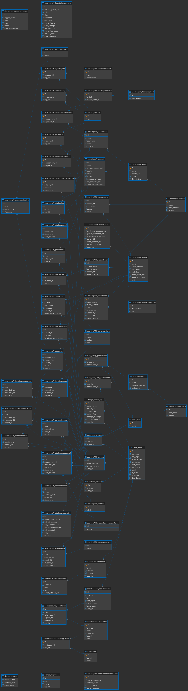

# Data Model

## 1. Database Diagram

## 2. Database Info
postgres 16
**Database type:**
relational
**ORM:**
django
## 3. Model to Table Mapping

| Model Name | Table Name |
|------------|------------|
| book   |  learningAPI_book          |
| capstone    |    learningAPI_capstone        |

| Property Name | Column Name | Data Type |
|---------------|-------------|-----------|
|   book            |  name           |  varchar         |
|   book            |  course_id           |  int         |
|   book            |   description          |   varchar        |

## 4. Relationship Examples

**One-to-one** (field name: )

| Model Name | Table Name | PK Column | FK Column |
|------------|------------|-----------|-----------|
| Model 1    |            |           |           |
| Model 2    |            |           |           |

**One-to-many** (field name: )

| Model Name | Table Name | PK Column | FK Column |
|------------|------------|-----------|-----------|
| Model 1    |            |           |           |
| Model 2    |            |           |           |

**Many-to-many** (field name: )

| Model Name | Table Name | PK Column | FK Column |
|------------|------------|-----------|-----------|
| Model 1    |            |           |           |
| Model 2    |            |           |           |
| (junction) |            |           |           |