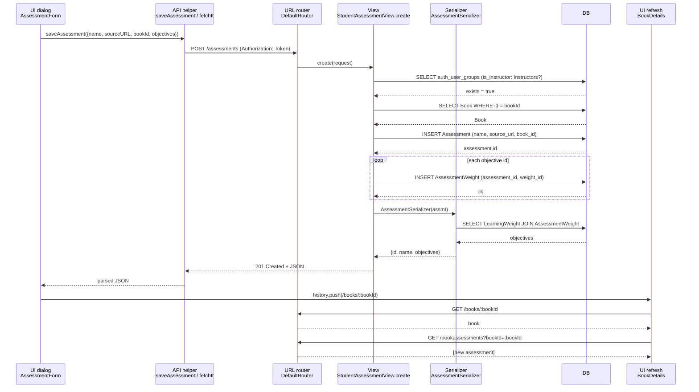

# Trace Notes (AI): assessments (learn-ops-api)

Feature traced: **an instructor creates a new book assessment** (`POST /assessments`).
This is the path the running UI actually uses. `StudentTabList.assign()` also posts to
`/assessments` (the student-assignment branch), but nothing in its JSX calls it.

### Request path table from Claude

| Layer      | File | Class / Function | What it does |
| ---------- | ---- | ---------------- | ------------ |
| UI dialog  | `learn-ops-client/src/components/assessments/AssessmentForm.js` | `AssessmentForm` → `create(evt)` | Form at `/assessments/new` where the instructor picks a book, enters a name and source URL, and checks objectives. On submit it calls `saveAssessment({...assessment, objectives: [...]})`. |
| API helper | `learn-ops-client/src/components/assessments/AssessmentProvider.js` → `utils/Fetch.js` | `saveAssessment()` → `fetchIt()` | Sends `POST ${apiHost}/assessments` with the JSON body. `fetchIt` adds `Authorization: Token <token>` and parses the 201 JSON response. |
| URL router | `learn-ops-api/LearningPlatform/urls.py` | `router.register(r'assessments', views.StudentAssessmentView, 'assessment')` | The DRF `DefaultRouter(trailing_slash=False)` maps `POST /assessments` to the viewset's `create` action. |
| View       | `learn-ops-api/LearningAPI/views/student_assessment.py` | `StudentAssessmentView.create` (checked by `StudentAssessmentPermission` and `@is_instructor()` from `LearningAPI/decorators.py`) | Checks that the user is in the `Instructors` group. If `name`, `sourceURL`, `objectives` and `bookId` are all present and the user `is_staff`, it builds an `Assessment` and one `AssessmentWeight` per objective. Otherwise it falls through to creating a `StudentAssessment`. |
| Serializer | `learn-ops-api/LearningAPI/views/student_assessment.py` | `AssessmentSerializer` (nests `AssessmentObjectiveSerializer`) | Turns the new `Assessment` into `{id, name, objectives: [{id, label}]}` for the 201 response. The serializer only formats output. The view reads `request.data` directly, so the serializer does no input validation. |
| DB         | `LearningAPI/models/people/assessment.py`, `LearningAPI/models/skill/assessment_weight.py` | `Assessment`, `AssessmentWeight`, `Book`, `LearningWeight` | Queries: (1) `auth_user_groups` check for `Instructors`; (2) `Book.objects.get(pk=book_id)`; (3) `INSERT` into Assessment via `assmt.save()`; (4) N × `INSERT` into AssessmentWeight via `AssessmentWeight.objects.create(...)`; (5) `SELECT` of the objectives through the M2M table while serializing. |
| UI refresh | `learn-ops-client/src/components/course/BookDetails.js` | `BookDetails` `useEffect` → `getBook(bookId)`, `getBookAssessment(bookId)` | After the POST resolves, `AssessmentForm` calls `history.push('/books/:bookId')`. `BookDetails` mounts and fetches the book, then `GET /bookassessments?bookId=…`, which shows the new assessment. |

**Things I noticed during the trace:**
- The two POST branches are chosen by which fields the request body has, not by the URL. A staff user who leaves out `objectives` falls into the `StudentAssessment` branch, which then raises a `KeyError` on `studentId`.
- The objective inserts are not wrapped in `transaction.atomic()`. If one `weight_id` is bad, the `Assessment` row stays saved without all of its objectives.
- `StudentAssessmentPermission` allows `update` and `partial_update`, and the client's `changeStatus()` sends `PUT /assessments/:id`. The viewset has no `update` method, so the router never maps PUT and `view.action` is `None`. `StudentAssessmentPermission` then returns `False`, and the PUT fails with a 403 before DRF can return a 405.

### Sequence Diagram

