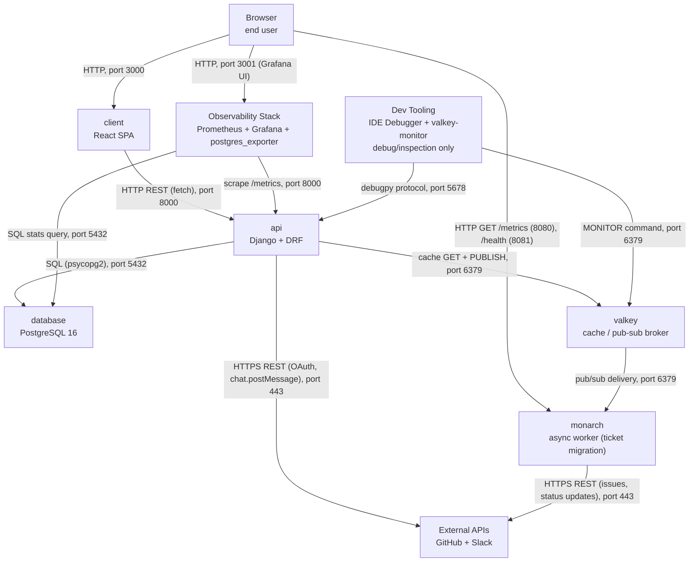

# System Map (AI)

## 1. System Diagram

Grouped for readability: **Dev Tooling** = IDE Debugger + valkey-monitor sidecar (debug-only, not core request flow). **Observability Stack** = Prometheus + Grafana + postgres_exporter (Grafana's Prometheus datasource query and Prometheus's scrape of postgres_exporter are now internal to this box). **External APIs** = GitHub + Slack.

## 2. Known Gaps / Caveats

- **api → valkey is a one-way cache read.** `popular_query.py` calls `valkey_client.get('search_results')`, but no code path in the api was found that ever `SET`s that key — the write side is either missing, dead, or lives outside this repo. Treat the "GET" edge as confirmed and the cache's population as an open question, not as a working read/write cache.
- **monarch's Prometheus metrics are not scraped.** `prometheus.yml` only defines `django` (`api:8000`) and `postgresql` (`postgres_exporter:9187`) jobs — there is no `monarch:8080` target. monarch exposes `/metrics` (port 8080, via `prometheus_client.start_http_server`) and `/health` (port 8081, via the Flask log web interface), but the only consumer of either today is a direct Browser/tooling request, not the Observability Stack.
- **nginx config exists but is unused here.** `learn-ops-api/config/nginx/` is not wired into any `docker-compose.yml` service in this environment, so it's correctly omitted from the diagram rather than a missing edge.